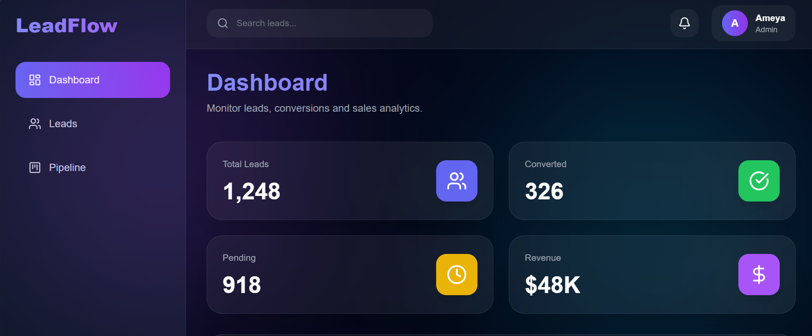
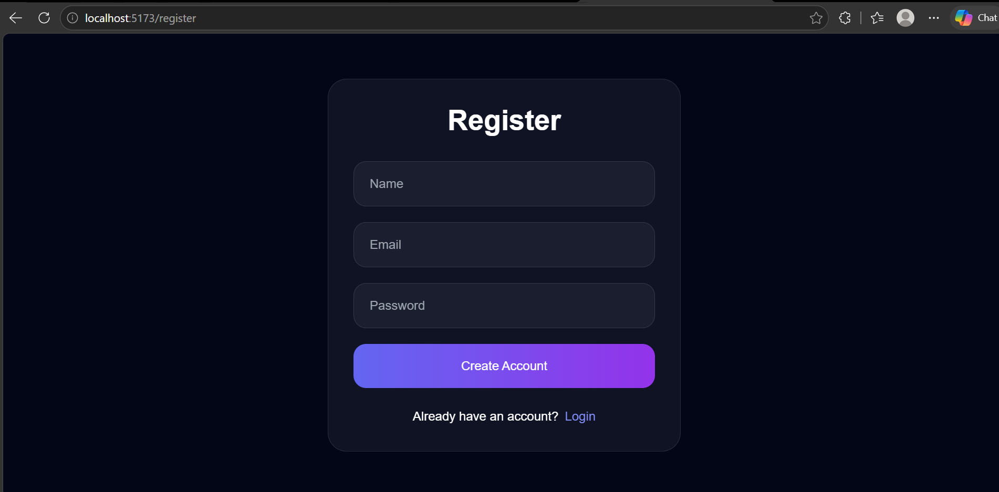

# 🚀 LeadFlow CRM

A modern full-stack SaaS-style CRM (Customer Relationship Management) platform built using React, Node.js, Express, and MongoDB Atlas.

LeadFlow CRM helps businesses manage customer leads, track sales pipelines, and organize client interactions through a clean and modern dashboard interface.

---

# 🌐 Live Demo

Frontend:
(Add Vercel URL Here)

Backend:
(Add Render URL Here)

---

# 📌 Features

## 🔐 Authentication System
- JWT-based authentication
- Secure login & registration
- Protected frontend routes
- Persistent login using localStorage
- Logout functionality

---

## 📊 Dashboard
- Modern SaaS dashboard UI
- Lead analytics overview
- Conversion tracking cards
- Responsive layout

---

## 👥 Lead Management
- Create new leads
- View all leads
- Delete leads
- Search/filter leads
- Update lead status
- Real-time UI updates

---

## 🔄 Sales Pipeline
- Visual lead tracking
- Status management
- CRM workflow simulation

---

## 🎨 UI/UX
- Fully responsive design
- Tailwind CSS styling
- Glassmorphism-inspired interface
- Smooth modern animations
- Sidebar navigation

---

# 🛠️ Tech Stack

## Frontend
- React.js
- React Router DOM
- Axios
- Tailwind CSS
- Framer Motion
- Lucide React Icons

---

## Backend
- Node.js
- Express.js
- MongoDB Atlas
- Mongoose
- JWT Authentication
- bcryptjs

---

# 📂 Project Structure

```bash
LeadFlow_CRM/
│
├── client/
│   ├── src/
│   │   ├── api/
│   │   ├── components/
│   │   ├── context/
│   │   ├── layouts/
│   │   ├── pages/
│   │   └── App.jsx
│   │
│   └── package.json
│
├── server/
│   ├── config/
│   ├── controllers/
│   ├── middleware/
│   ├── models/
│   ├── routes/
│   ├── utils/
│   ├── server.js
│   └── package.json
│
└── README.md

⚙️ Installation & Setup

1️⃣ Clone Repository
git clone https://github.com/yourusername/leadflow-crm.git

2️⃣ Open Project
cd leadflow-crm

3️⃣ Setup Backend
cd server
npm install

4️⃣ Create .env File Inside server
PORT=5000

MONGO_URI=your_mongodb_connection_string

JWT_SECRET=your_secret_key

5️⃣ Run Backend
npm run dev

Backend runs on:

http://localhost:5000

6️⃣ Setup Frontend

Open new terminal:
cd client
npm install

7️⃣ Run Frontend
npm run dev

Frontend runs on:

http://localhost:5173

🔗 API Endpoints
Authentication
Register User
POST /api/auth/register
Login User
POST /api/auth/login
Leads
Get All Leads
GET /api/leads
Create Lead
POST /api/leads
Delete Lead
DELETE /api/leads/:id
Update Lead Status
PUT /api/leads/:id

🔒 Authentication Flow
User registers/login
Backend generates JWT token
Token stored in localStorage
Axios interceptor attaches token
Protected routes validate access

📸 Screenshots
Dashboard



Leads Page
[!Leads](./screenshots/lead.png)

Login Page



🚀 Deployment
Frontend Deployment
Vercel
Backend Deployment
Render
Database
MongoDB Atlas

🧠 Learning Outcomes

This project demonstrates:

Full-stack development

REST API architecture

Authentication systems

MongoDB integration

Frontend/backend integration

State management

Deployment workflows

Modern UI design principles


📈 Future Improvements

Drag-and-drop Kanban board
Email integration
Role-based authentication
Real-time notifications
Team collaboration
Data analytics charts
Dark/light theme toggle

👨‍💻 Author

Ameya Joshi

⭐ If you like this project

Give it a star on GitHub ⭐