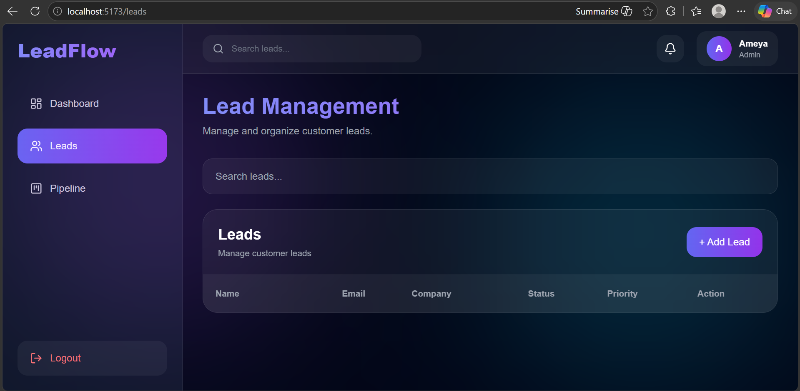

# 🚀 LeadFlow CRM

A modern full-stack SaaS-style CRM (Customer Relationship Management) platform built using React, Node.js, Express, and MongoDB Atlas.

LeadFlow CRM helps businesses manage customer leads, track sales pipelines, and organize client interactions through a clean and modern dashboard interface.

---

# 🌐 Live Demo

## Frontend

(Add Vercel URL Here)

## Backend

(https://leadflow-crm-backend-dera.onrender.com)

---

# 📌 Features

## 🔐 Authentication System

* JWT-based authentication
* Secure login & registration
* Protected frontend routes
* Persistent login using localStorage
* Logout functionality

---

## 📊 Dashboard

* Modern SaaS dashboard UI
* Lead analytics overview
* Conversion tracking cards
* Responsive layout

---

## 👥 Lead Management

* Create new leads
* View all leads
* Delete leads
* Search/filter leads
* Update lead status
* Real-time UI updates

---

## 🔄 Sales Pipeline

* Visual lead tracking
* Status management
* CRM workflow simulation

---

## 🎨 UI/UX

* Fully responsive design
* Tailwind CSS styling
* Glassmorphism-inspired interface
* Smooth modern animations
* Sidebar navigation

---

# 🛠️ Tech Stack

## Frontend

* React.js
* React Router DOM
* Axios
* Tailwind CSS
* Framer Motion
* Lucide React Icons

---

## Backend

* Node.js
* Express.js
* MongoDB Atlas
* Mongoose
* JWT Authentication
* bcryptjs

---

# 📂 Project Structure

```bash
LeadFlow_CRM/
│
├── client/
│   ├── src/
│   │   ├── api/
│   │   ├── components/
│   │   ├── context/
│   │   ├── layouts/
│   │   ├── pages/
│   │   └── App.jsx
│   │
│   └── package.json
│
├── screenshots/
│   ├── dashboard.png
│   ├── leads.png
│   ├── login.png
│   └── register.png
│
├── server/
│   ├── config/
│   ├── controllers/
│   ├── middleware/
│   ├── models/
│   ├── routes/
│   ├── utils/
│   ├── server.js
│   └── package.json
│
└── README.md
```

---

# ⚙️ Installation & Setup

---

## 1️⃣ Clone Repository

```bash
git clone https://github.com/yourusername/leadflow-crm.git
```

---

## 2️⃣ Open Project

```bash
cd leadflow-crm
```

---

# 🔧 Backend Setup

## 3️⃣ Move to Server Folder

```bash
cd server
```

---

## 4️⃣ Install Backend Dependencies

```bash
npm install
```

---

## 5️⃣ Create `.env` File

Create a `.env` file inside the `server` folder and add:

```env
PORT=5000

MONGO_URI=your_mongodb_connection_string

JWT_SECRET=your_secret_key
```

---

## 6️⃣ Run Backend

```bash
npm run dev
```

Backend runs on:

```bash
http://localhost:5000
```

---

# 🎨 Frontend Setup

## 7️⃣ Open New Terminal

```bash
cd client
```

---

## 8️⃣ Install Frontend Dependencies

```bash
npm install
```

---

## 9️⃣ Run Frontend

```bash
npm run dev
```

Frontend runs on:

```bash
http://localhost:5173
```

---

# 🔗 API Endpoints

# Authentication

## Register User

```http
POST /api/auth/register
```

---

## Login User

```http
POST /api/auth/login
```

---

# Leads

## Get All Leads

```http
GET /api/leads
```

---

## Create Lead

```http
POST /api/leads
```

---

## Delete Lead

```http
DELETE /api/leads/:id
```

---

## Update Lead Status

```http
PUT /api/leads/:id
```

---

# 🔒 Authentication Flow

1. User registers/login
2. Backend generates JWT token
3. Token stored in localStorage
4. Axios interceptor attaches token
5. Protected routes validate access

---

# 📸 Screenshots

## Dashboard


---

## Leads Page



---

## Login Page


---


# 🚀 Deployment

## Frontend Deployment

* Vercel

---

## Backend Deployment

* Render

---

## Database

* MongoDB Atlas

---

# 🧠 Learning Outcomes

This project demonstrates:

* Full-stack development
* REST API architecture
* Authentication systems
* MongoDB integration
* Frontend/backend integration
* State management
* Deployment workflows
* Modern UI design principles

---

# 📈 Future Improvements

* Drag-and-drop Kanban board
* Email integration
* Role-based authentication
* Real-time notifications
* Team collaboration
* Data analytics charts
* Dark/light theme toggle

---

# 👨‍💻 Author

## Ameya Joshi

GitHub:
(Add GitHub URL)

LinkedIn:
(Add LinkedIn URL)

---

# ⭐ If You Like This Project

Give it a star on GitHub ⭐
